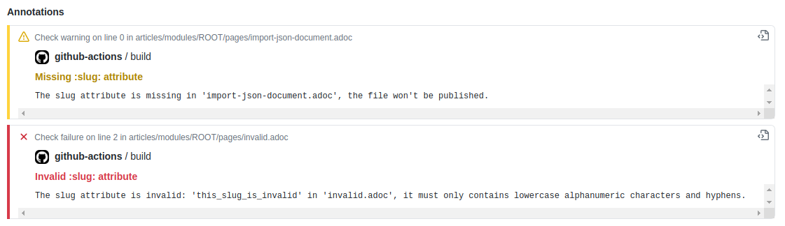
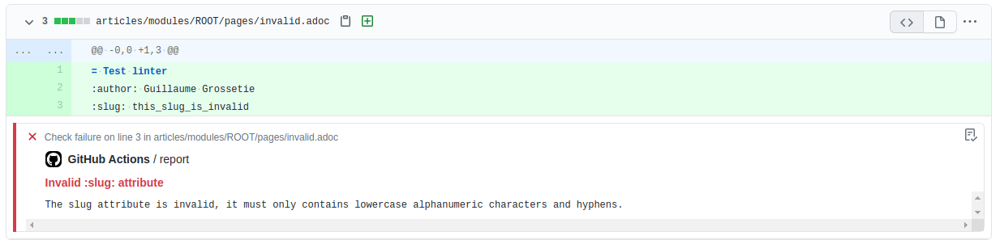

= Neo4j Knowledge Base
ifdef::env-github[]
:tip-caption: :bulb:
:note-caption: :information_source:
:important-caption: :heavy_exclamation_mark:
:caution-caption: :fire:
:warning-caption: :warning:
endif::[]

This repository is a knowledge base for Neo4j.

It contains *public* articles that cover questions, problems, and issues with Neo4j.

All articles will be published for everyone to see under https://neo4j.com/developer/kb/.
The articles will also be available on the Zendesk knowledge base: https://support.neo4j.com/hc/en-us/sections/200574983-Knowledge-Base.

== Intent / Workflow

If you answer questions on Neo4j in support, on Stack Overflow, Google Group, Slack or Twitter,
please make sure to rather link to an up-to-date article originated in the Knowledge Base than writing an answer from scratch.

This will also prevent *out of date content* accumulate in other places where it might get a high Google Rank without us having any means to update or clarify it.

If there is no up-to-date article for a topic of general interest, please create one.
If there is an article, but it is outdated, please update the article, and the `neo4j-versions` attribute.

The goal is to start this as a GitHub repository but going forward to render it as part of the documentation / developer pages.

Also, all code that will be included should be tested by a build process / being pulled out of test cases.

== Structure

Each article is written in AsciiDoc.

You can start by copying the link:./template.adoc[template article].

Feel free to add / edit articles directly on GitHub, but make sure to send a *Pull Request* so the updates are reviewed before being made public.

You can use prose, headlines, sections, images, source-code blocks, links to GH repositories and other resources.

[NOTE]
But please keep it reasonably short and to the point.

It contains some additional fields:

* `:author:` (optionally `:twitter:`)
* `:neo4j-versions:`, e.g. `3.5`, `4.0`
* `:category:`, e.g.  `drivers`
* `:tags:`, e.g. `cypher,tuning`
* `:environment:` e.g. `windows`

=== Slugs & File Names

All articles need to have a `slug` attribute so that we can tie them to the appropriate article on Zendesk.
The `slug` attribute must only contains lowercase alphanumeric characters and hyphens to make it a good URL.
No spaces, no uppercase, no leading, trailing or double hyphens.

The article file name must be the same as the `slug` attribute.
It must only contains lowercase alphanumeric characters and hyphens, e.g. `how-to-run-consistency-check.adoc`.

[IMPORTANT]
====
If a slug is changed, a *new* article will be published and any former links to the article will be *broken*.
If you need to update the slug of an article but you want to update the existing article, the you will need to set the attribute `:zendesk-id:` on the article.

For instance, in the article above, we will update the Zendesk article using the id `206226107`:

[source,adoc]
----
= Cross Product Cypher queries will not perform well
:slug: cross-product-cypher-queries-will-not-perform-well
:zendesk-id: 206226107
----

We can now safely update the slug, it won't publish a new article on Zendesk and the URL will be preserved.
====

For Zendesk it means that the article will be deleted and the article id won't be recoverable, leaving links permanently broken.

WARNING: When a slug is invalid, no document will be deployed until the slug is fixed.

You can find out if a slug failed on the https://github.com/neo4j-documentation/knowledge-base/actions?query=workflow%3ABuild[GitHub Actions] build.
We recommend that you subscribe to notifications for the builds so that you can receive an email whenever a build fails and whenever it starts again.

=== Versions

* 3.4, 3.5, 4.0, 4.1

Optionally add minor versions / milestones as additional versions separated with comma / in the prose if relevant.

=== Tag Taxonomy

See link:./kb-categories.txt[]

== Code Snippets

If you use code-snippets, please make sure to mark them with the correct source, e.g. `[source,cypher]`, `[source,java]`.

For Cypher, you can also provide a setup section or file as part of the repository.

Feel also free to use graph-gist syntax here, e.g. `//setup, //graph, //graph_result, //table`, so that we can chose to render the files as graphgists.

For code snippets you can include http://asciidoctor.org/docs/user-manual/#by-tagged-regions[tagged sections] from either a runnable project in a sub-directory in any programming-language or another github-repository.

[NOTE]
Make sure to update those code examples alongside with the article.

=== Code Snippets Example

[source,asciidoc]
....
[source,java]
----
\include::sources/java/src/test/java/example/CreateData.java[tags=create_data]
----
....

[source,java]
----
package example;

import org.neo4j.*;

public class CreateDataTest {
  @Test public void createData() {
    //tag::create_data[]
    try (Transaction tx = db.beginTx()) {
      Node n = tx.createNode(Labels.Person);
      n.setProperty("name","Emil");
      Node m = tx.createNode(Labels.Person);
      m.setProperty("name","Peter");
      n.createRelationshipTo(m,Types.KNOWS);
      // calling success is important to mark the transaction successful
      tx.commit();
    }
    //end::create_data[]
  }
}
----

Will result in:

[source,java]
----
try (Transaction tx = db.beginTx()) {
   Node n = tx.createNode(Labels.Person);
   n.setProperty("name","Emil");
   Node m = tx.createNode(Labels.Person);
   m.setProperty("name","Peter");
   n.createRelationshipTo(m,Types.KNOWS);
   // calling success is important to mark the transaction successful
   tx.commit();
}
----

== Linter task

To ensure that all articles are following the guidelines, we enforce a set of rules using a linter.

The linter task will be executed as part of the https://github.com/neo4j-documentation/knowledge-base/actions?query=workflow%3ALint[GitHub Actions] build.

You can also run the linter task locally using `npm`.
As a prerequisite, you will need to download and install https://nodejs.org/en/[Node].
Once Node is installed, open a terminal and execute the following command at the root of this project to install the dependencies:

[source,console]
$ npm i

Then, execute the `lint` task:

[source,console]
$ npm run lint

If something is incorrect, you will get an error in the console, for instance:

....
> @neo4j/knowledge-base@1.0.0 lint /home/guillaume/workspace/neo4j/knowledge-base-public
> node tasks/lint.js

ERROR: The slug attribute 'this_slug_is_invalid' is invalid in 'invalid.adoc', it must only contains lowercase alphanumeric characters and hyphens.
npm ERR! code ELIFECYCLE
npm ERR! errno 1
npm ERR! @neo4j/knowledge-base@1.0.0 lint: `node tasks/lint.js`
npm ERR! Exit status 1
npm ERR!
npm ERR! Failed at the @neo4j/knowledge-base@1.0.0 lint script.
npm ERR! This is probably not a problem with npm. There is likely additional logging output above.

npm ERR! A complete log of this run can be found in:
npm ERR!     /home/guillaume/.npm/_logs/2020-10-23T07_03_13_504Z-debug.log
....

=== Annotations

On GitHub Actions build, the code will be annotated if there are any issues.
Here's an example:

Annotations are created by the https://github.com/yuzutech/annotations-action[annotations-action] from the `annotations.json` file.
The `annotations.json` file is generated by the `npm run lint` task and contains a JSON array.

Annotations are contextual, and they will be visible on your pull request in the "Files changed":

== Gradle Tasks

=== Show taxonomies

Show all the taxonomies defined on all the articles:

 $ ./gradlew showTaxonomies

NOTE: This task can be useful to review all the taxonomies.

=== Convert articles to HTML

Before publishing you can convert the articles to HTML:

 $ ./gradlew convertZenDeskHtml

The HTML pages will be generated in [.path]_build/zendesk/html_.

=== Publish to Zendesk

Articles can be published on the Enterprise Customer Support (support.neo4j.com) and/or on the Aura Customer Support.
By default, all articles are published on the Enterprise Customer Support.
If you don't want to publish on the Enterprise Customer Support for a specific article, you can add the following attribute in the article header:

[source,asciidoc]
----
:enterprise!:
----

If you want to publish on the Aura Customer Support, then you need to add the following attribute in the article header:

[source,asciidoc]
----
:aura:
----

The `aura` attribute can take a comma-separated list of values.
Currently, the following list of values is supported (with their corresponding section id):

[cols="1m,1m",opts=header]
|====
|Value
|Id

|help-center/knowledge-base
|360005376634

|home-page/getting-started
|360005850813
|====

Here's an example where the article will be published on both the "Help Center > Knowledge Base" section and on the "Home Page > Getting Started" section:

[source,asciidoc]
----
:aura: help-center/knowledge-base,home-page/getting-started
----

==== Properties

You can define the properties using `-P` in the Gradle command line.

`zendesk-email`::
Email of an Agent account on Zendesk

`zendesk-apitoken`::
API token generated from the Admin page on Zendesk

==== Examples

.Publish
 $ ./gradlew zenDeskUpload -Pzendesk-email="user@neo4j.com" -Pzendesk-apitoken="apitoken"

== Antora

=== Live Preview

You can preview the Knowledge Base site locally using `npm`.
As a prerequisite, you will need to download and install https://nodejs.org/en/[Node].
Once Node is installed, open a terminal and execute the following command at the root of this project to install the dependencies:

[source,console]
$ npm i

Then, execute the `watch` task:

[source,console]
$ npm run watch

This will build a set of HTML files in _public_ and then serve them through a local HTTP server at http://localhost:3000.
The `watch` script will also listen for changes and automatically rebuild the files and refresh the page.

=== Publishing

Pushing to the `master` branch of this repo will trigger a rebuild of the HTML and CSS files in the `neo4j-documentation/docs-refresh` repo using a Github Action.
The HTML and CSS files will then be synchronized to S3 and live at: https://neo4j.com/developer/kb.